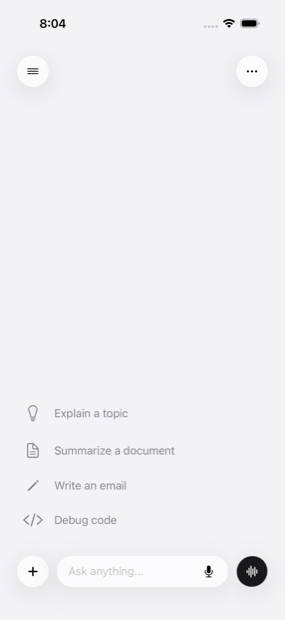
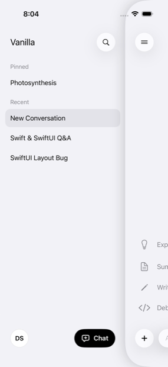
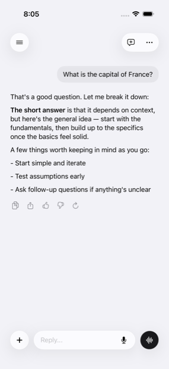

# Vanilla

**An out of the box LLM experience for iOS.**

Vanilla is an LLM UX template built in SwiftUI for iOS 26 (Swift 6). Integrate your own model and customize Vanilla's UX to match your app.

| New conversation | Drawer | Streamed reply |
|:---:|:---:|:---:|
|  |  |  |

## What you get

- **A single-root conversation with a slide-over drawer** No navigation stack, no back button. Conversations swap underneath a persistent drawer.
- **Streaming message reveal** Assistant replies stay hidden while streaming, then cascade in via a custom `TextRenderer` once complete.
- **Scroll ownership that doesn't fight you** Pinned-send model where the new message lands in a predictable spot every time, with elastic boundaries at both ends. This is the part with a 90KB design document behind it.
- **Keyboard coordination** Composer and conversation move together, driven by captured keyboard animation curves rather than guessed durations.
- **Liquid Glass throughout** Native iOS materials, with the rough edges documented in *Known platform gotchas* below.
- **Hands-free voice mode** Mic → on-device speech recognition → the normal chat pipeline → spoken reply, as a full-screen live call UI.
- **Full-screen conversation search** Morphs out of the drawer's search button.
- **A real design token system** Color, typography, spacing, radius, and motion, with no raw values outside the token files.

## Swap in your model

The entire AI surface is one protocol:

```swift
@MainActor
protocol AIService {
    func send(message: String, context: [Message]) async throws -> AsyncStream<String>
}
```

Write one conforming type that calls your API, then change one line in
`Vanilla/App/AppContainer.swift`:

```swift
self.aiService = MyRealAIService()   // was MockAIService()
```

**Note:** Errors are currently caught as a single catch-all in `ConversationViewModel`, which marks the message `.failed` and shows one generic string. `AIServiceError` distinguishes `.rateLimited` from `.connectionLost`, but the UI doesn't yet — a real backend probably wants those handled differently.

## What's real and what isn't

Being explicit so you know what you're inheriting:

| | Status |
|---|---|
| Interface, motion, layout, voice mode | Complete and tuned |
| AI responses | `MockAIService` — canned text on a timer |
| Persistence | **None.** `ConversationStore` is in-memory, seeded from `SampleData`. Back it with SwiftData or your own layer. |
| Auth, accounts, subscriptions | UI only — the Settings rows are literally `Button {}` |
| Error handling | One generic catch-all (see above) |
| Markdown rendering | Trusts its input, because its input is a mock |

That last row matters if you ship this: `MarkdownView` was written for content
from `MockAIService`, not from the open internet. Harden it before pointing the
app at a live model.

## Requirements

- Xcode 26+
- iOS 26 simulator or device
- [XcodeGen](https://github.com/yonaskolb/XcodeGen) (`brew install xcodegen`)

## Build

The Xcode project is generated from `project.yml` and is **not** checked in.
Generate it, then open:

```sh
xcodegen generate
open Vanilla.xcodeproj
```

Run the `Vanilla` scheme on an iOS 26 simulator. After adding or removing
source files, re-run `xcodegen generate` — otherwise the build fails with
"cannot find X in scope."

## Making it yours

The name lives in a handful of places:

- `project.yml` — project, target, scheme, source paths, `CFBundleDisplayName`,
  and the camera/mic/speech usage strings
- The `Vanilla/` source folder and `VanillaDebugUITests/`
- `VanillaApp.swift` — the `@main` struct
- The drawer header in `ConversationSidebar.swift`, and two strings in
  `ProfileSheet.swift`

The bundle ID is `PRODUCT_BUNDLE_IDENTIFIER` in `project.yml`. After renaming
folders or editing `project.yml`, re-run `xcodegen generate`.

## Structure

```
Vanilla/
  App/           App entry, container, root drawer/chat composition
  Features/      Conversation, Voice (live call UI + view model), Artifact,
                 Search, Settings screens (view + view model + state)
  Components/    Chat, Foundation, Artifact, Search, Settings, Voice views
  Models/        Conversation, Message, Artifact, Attachment, VoiceOption
  Navigation/    Coordinator + router
  Services/      AIService protocol + mock, conversation store
  Theme/         Color, typography, spacing, radius, animation tokens
  Utilities/     Helpers (keyboard animation capture, Markdown tables, sample
                 data) and Extensions

VanillaDebugUITests/
                 Separate Xcode target — manual drivers, not CI tests and with
                 no assertions. `ScrollBugUITests` is a repro harness for
                 scroll regressions (see CONVERSATION-ARCHITECTURE.md
                 §4.11/§4.12); `ScreenshotTests` regenerates the images above.
```

## Documentation

Three documents, all at the repo root:

- **`CONVERSATION-ARCHITECTURE.md`** The authoritative spec for conversation
  behavior: viewport, motion, scroll ownership, keyboard coordination,
  composer, lifecycle, streaming, history navigation, accessibility. Start here
  before changing anything about how the conversation moves.
- **`DESIGN.md`** The actual values behind every design token.
- **`SPEC.md`** Component philosophy and app-wide rules.

Code comments cite these as `spec §X.Y`, so a citation you find in a file
resolves to a section you can go read.

## Known platform gotchas

Documented because each one cost real debugging time on iOS 26:

- `.glassEffect()` with `.buttonStyle(.plain)` silently breaks tap handling.
  Use the default button style.
- A `Menu` sharing a `GlassEffectContainer` with sibling glass buttons flickers
  permanently on any sibling change. Give the `Menu` its own container.
- Interactive glass pulses when a view is freshly constructed. The fix is
  removing the animation source, not suppressing it on the glass view.
- SwiftUI content hosted in a scroll view shifts down by one safe-area inset
  once it scrolls past the screen top. `safeAreaRegions = []` fixes it.
- Some glass artifacts reproduce **only** in the Simulator. Build to hardware
  before chasing one.

## License

[MIT](LICENSE) — free to use, modify, and ship commercially. Keep the
copyright notice with it (an "Open Source Licenses" screen is the usual home
for this).

If Vanilla saved you some time, a visible credit or a link back is always
appreciated.
